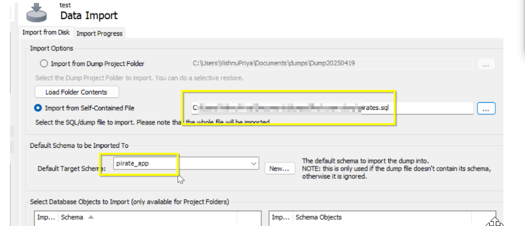
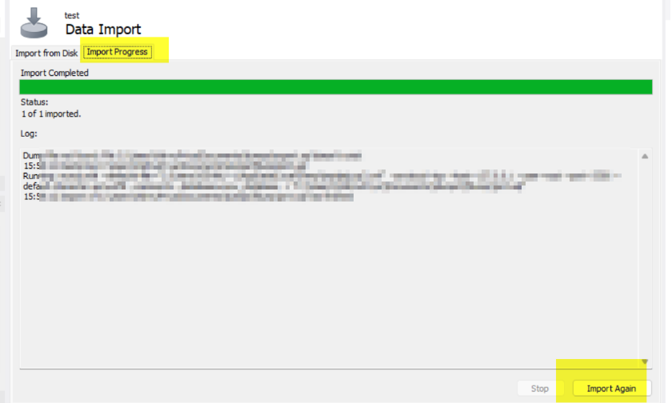
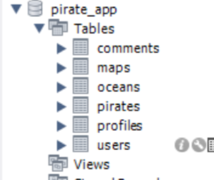

# Pirates-of-the-Web
This is a vulnerable web application 
Set in up locally and start practicing OWASP top ten vulnerablities 

## Pirates Vuln Web App Set Up
Download mysql workbench, create user with creds in mysql

    user: 'root', // or your custom user
    password: '1234567890', // your MySQL password

use the pirates.sql from /sql directory 

Now create database

CREATE DATABASE pirate_app;
USE pirate_app;

Go to MYSQL : Server > Click on DATA IMPORT

Select pirate_app in default schema and the file to be imported 

Import the .sql file to a database you created 

This is the ideal db import 
 

Database is done!!!

Now lets go ahead with app set up, unzip and cross check, and .env file 

Cross Check DB.js

 host: 'localhost',
  user: 'root', // or your custom user
  password: '1234567890', // your MySQL password
  database: 'pirate_app'

Step 2: 

npm install

### Run the app
 npx nodemon app.js

Terms: 
- If you set it up, There are specfic vulnerablities which can be coupled with the open ports and make you device vulnerble to popular web attacks 